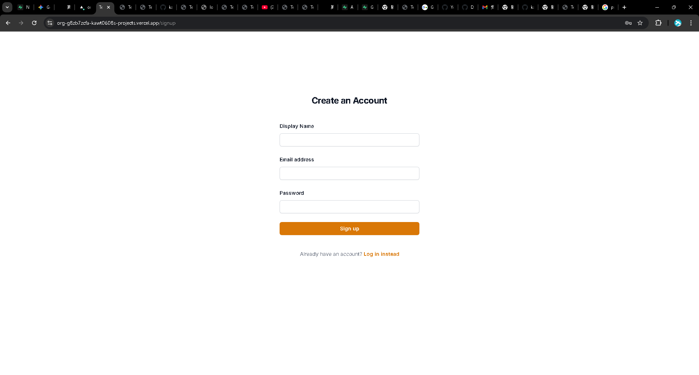
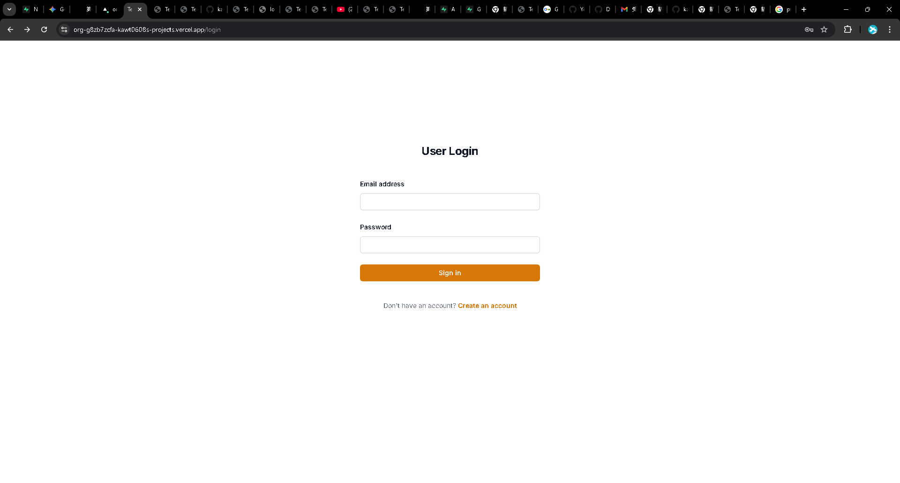
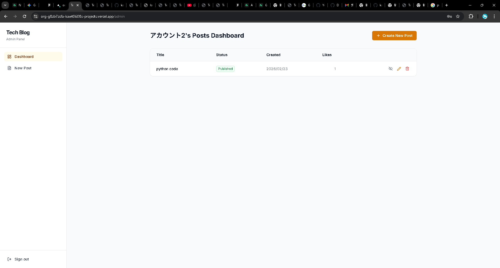
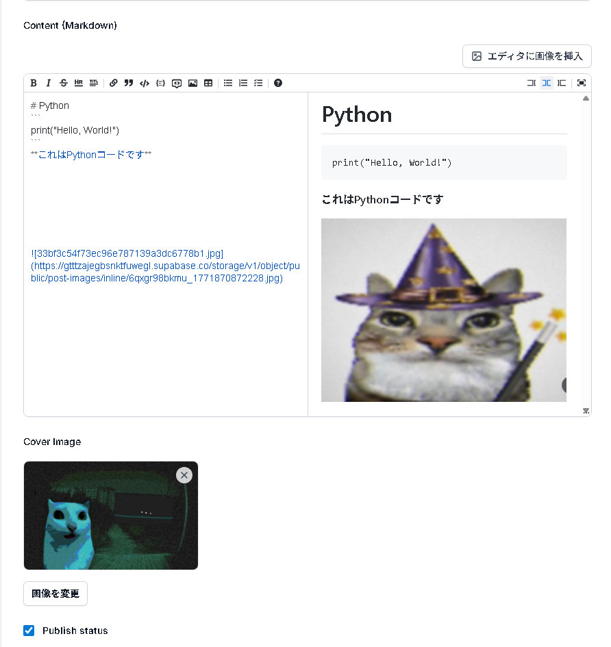
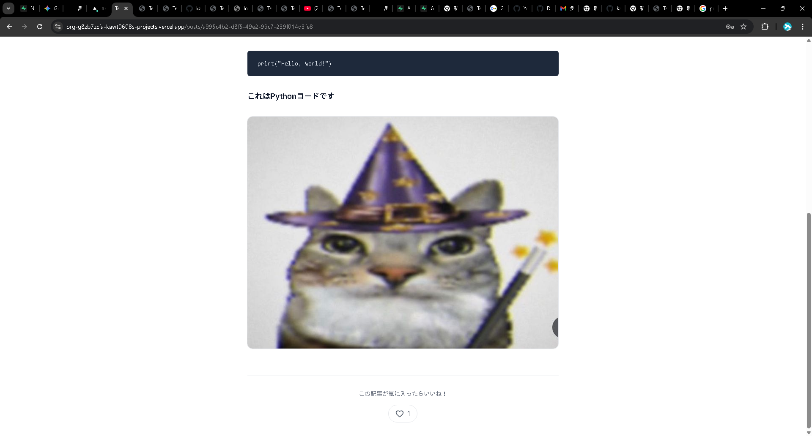
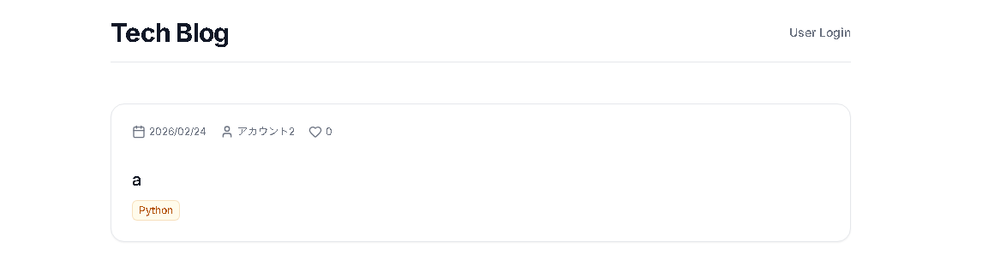
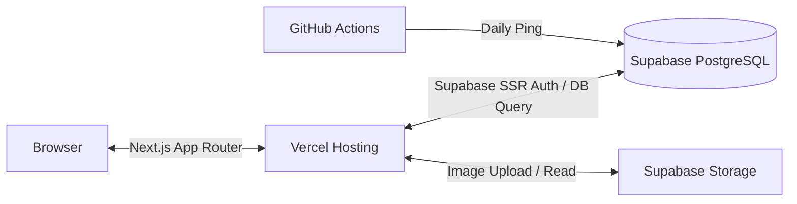

# Org Blog App

**公開URL**: https://org-g8zb7zcfa-kawt0608s-projects.vercel.app/

## アプリの概要
本アプリケーションは、Next.js (App Router) と Supabase を活用して開発されたオリジナルブログアプリケーションです。
一般ユーザーはマークダウンで装飾された記事を快適に閲覧でき、認証不要で「いいね」を押して気軽に反応を示すことができます。一方、管理者は認証で保護されたダッシュボードから、リッチで直感的なマークダウンエディタを用いて効率よく記事を執筆・管理できるよう設計されています。

## 開発の背景・経緯
本アプリは、モダンなWeb技術（Next.js / Supabase）を活用した「実践的かつ高機能なブログプラットフォーム」をゼロから自主開発することを目標としたプロジェクトです。
単なるテキストの保存（CRUD）にとどまらず、実際のブログ運営で求められる「リッチなマークダウン入力」「画像のインライン挿入」「柔軟なタグ付け管理」といった要件を満たすことで、開発技術の探求とともに、優れたユーザー体験（UX）と管理者側の執筆効率を両立させるシステムを目指しています。

---

## テスト認証情報
管理画面や記事編集の動作確認用に、以下のテストアカウントを用意しています。

* **ログインURL**: `/login`
* **Eメール**: `user@example.com`
* **パスワード**: `password123`

---

## 特徴と機能の説明

### 1. 堅牢な認証と管理ダッシュボード
Supabase Authによるメール/パスワード認証を実装。Next.js の Middleware (`middleware.ts`) により `/admin` 以下のすべてのルートを保護し、未ログインユーザーの不正アクセスを遮断しています。

*アカウント作成画面（サインアップ画面）*

*ログイン画面*

*管理ダッシュボード。自身の記事を一覧し、作成・編集・削除を行います。*

### 2. 直感的なリッチマークダウンエディタ
`@uiw/react-md-editor` を導入し、太字やリストなどの装飾をツールバーから簡単に入力できる直感的なインターフェースを実現しました。
執筆画面とリアルタイムプレビュー画面を同時に確認でき、記述ミスを防ぎます。

*プレビューしながら直感的に執筆できるリッチマークダウンエディタ*

### 3. 本文へのシームレスな画像挿入（インライン画像アップロード）
記事本文中に画像を挿入したい場合、エディタ上部のボタンからローカルの画像をアップロードすると、Supabase Storage に即座に保存され、カーソル位置にマークダウン記法 `` として自動挿入される機能を実装しました。
`Tailwind CSS Typography` プラグインと独自のCSSにより、大きな画像も記事幅に収まるよう自動リサイズして見切れを防止しています。

### 4. 快適な記事閲覧体験
一般ブラウザ上の表示は、マークダウンが美しくレンダリングされ、アップロードしたカバー画像も合わせて適切に表示されるようレイアウトされています。

*実際の記事の閲覧画面*

### 5. ログイン不要の「いいね」機能
一般ユーザーが記事を読んだ際、気軽にリアクションできるよう、ログイン認証を経由せずに押せる「いいね」機能を実装しました。
データベース上で各記事の `likes_count` と連動して即座に反映されます。

### 6. 記事のタグ付け・分類機能
投稿記事に対して複数の「タグ」をコンマ区切りで自由に追加できる機能を実装しました。
ダッシュボード一覧や記事詳細ページでバッジとして表示され、記事のトピックを一目で把握できるようになっています。

*記事作成時および閲覧時のタグ表示*

### 7. インフラの自動保守（Supabase Ping）
Supabaseの無料プラン特有の「7日間アクセスが無いとプロジェクトが一時停止（Pause）する」仕様を回避するため、GitHub Actions を構築。
定期的（毎日）に軽量なクエリを実行し、システムを常に稼働状態に保ちます。

## 使用技術 (技術スタック)

- **Frontend**
  - 言語: TypeScript
  - フレームワーク: Next.js 16 (App Router)
  - スタイリング: Tailwind CSS (Typography プラグイン活用)
  - マークダウン制御: `react-markdown`, `@uiw/react-md-editor`
  - アイコン: `lucide-react`
  - 状態管理/フォーム: React 19 (Server Actions, `useActionState`)

- **Backend / DB / Auth**
  - Supabase Database (PostgreSQL) + Row Level Security (RLS)
  - Supabase Authentication
  - Supabase Storage

- **CI/CD・ホスティング**
  - Vercel (デプロイ環境)
  - GitHub Actions (自動Ping処理)

- **システム構成図**

## 開発期間・体制

- **開発体制**: 個人開発
- **開発期間**: 2026年1月 〜 2026年2月

## 工夫した点・苦労した点

- **Markdownエディタと画像アップロードの結合**
  単なるテキストエリアではなく、本文中に画像をインラインで埋め込めるリッチエディタの実装に苦労しました。画像がアップロードされたのち、StorageのPublic URLを取得して現在のカーソル位置へマークダウンとして挿入するロジックを自作し、スムーズな執筆体験を実現しました。
- **Server Actionsの適切なエラーハンドリング**
  Next.js の Server Actions におけるフォーム処理で、エラー時に画面がクラッシュしてしまう問題に直面しました。React 19 の `useActionState` を活用して入力フォームをクライアントコンポーネント化し、バリデーションエラー時には画面遷移せずに分かりやすいエラー文言をUI上に表示するよう改修を行いました。

## 既知の課題と今後の展望

- **画像の最適化**
  現状はアップロードされた画像をそのままStorageに保存・配信しているため、Next.jsの `<Image>` コンポーネント等を用いてリサイズやWebP化などを行い、表示速度を向上させたいです。
- **タグによる絞り込み検索機能**
  記事に付与されたタグをクリックすることで、同じタグが付けられた記事一覧を表示するフィルタリング機能の追加を構想しています。
